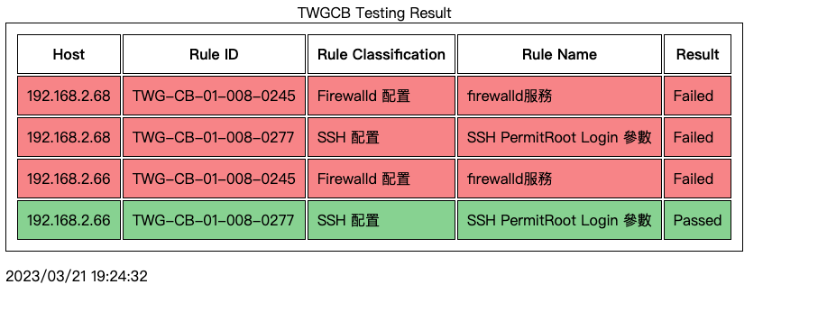

# TWGCB Practice

Simple Ansible playbooks for detecting and adjusting [TWGCB policies](https://www.nics.nat.gov.tw/UploadFile/attachfilegcb/TWGCB-01-008_Red%20Hat%20Enterprise%20Linux%208%E6%94%BF%E5%BA%9C%E7%B5%84%E6%85%8B%E5%9F%BA%E6%BA%96%E8%AA%AA%E6%98%8E%E6%96%87%E4%BB%B6v1.0_1100924.pdf) on RHEL 8.

## TWGCB Rule
At the present, this project only support the following TWGCB rules. The other rules will be added in the future.

* (TWG-CB-01-008-0245) Firewalld Configruation
    * Check if firewalld is enabled or not.
* (TWG-CB-01-008-0277) Disabled SSH Root Login
    * Check if sshd `PermitRootLogin` is disabled or not.

## Quick Start
Start detection.
```
$ ansible-playbook -i hosts.ini check_env.yml
```
Fix the environment.
```
# For all managed nodes
$ ansible-playbook -i hosts.ini fix_env.yml

# For the specific nodes
$ ansible-playbook -i hosts.ini fix_env.yml --limit 192.168.0.1

```

## Retrieve Output
The detection result will be converted to HTML format and exported to `results_path`. (Default:`/tmp/twgcb`).

```
$ ls /tmp/twgcb
results.html
```
